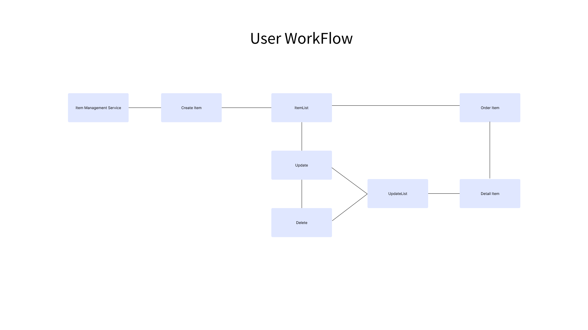

# **[ 재고 관리 서비스 ]**

**[Click here to try!](product-mangement-system-a318c.web.app)**

<aside>
⭐ 만들게 된 계기 ⭐

- 20대 초반, 여러가지 일을 하며 
  재고정리를 할 때 번번히 창고에 들락날락했던 기억이 떠올라 만들게 되었습니다.
</aside>

---
브랜치 
### 🔎구현 기능
---

1. 메인 페이지에서 현재 재고 상태를 볼 수 있습니다
2. 물품 추가 버튼을 통해 물품을 추가 할 수 있습니다.
3. 물품 제거 버튼을 통해 더이상 사용하지 않는 물건을 삭제 할 수 있습니다.
4. 로컬 스토리지가 아닌 Firebase DB를 사용해 안정성을 높였습니다.
5. 반응형 레이아웃으로 모바일 기기에서도 사용이 가능합니다.
6. 데이터가 추가되면 스크롤을 통해 물품을 계속해서 볼 수 있습니다.
7. 검색창을 통해 원하는 물품의 재고를 검색할 수 있습니다. (구현예정)
8. 물품의 이미지를 클릭해 해당 상품의 자세한 정보를 볼 수 있습니다 (구현예정)

---

### **<유저 플로우>**
